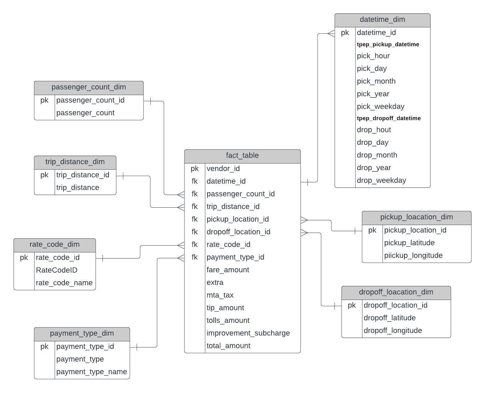

# Uber Data Analytics | Modern Data Engineering GCP Project

## Introduction

The goal of this project is to perform data analytics on Uber data using various tools and technologies, including Google Cloud Platform (GCP) services like Google Storage, Compute Instance, BigQuery, and Looker Studio. Additionally, a modern data pipeline tool, [Mage Data Pipeline Tool](https://www.mage.ai/), will be utilized.

## Architecture

## Technology Used

- Programming Language: Python
- Google Cloud Platform:
  1. Google Storage
  2. Compute Instance
  3. BigQuery
  4. Looker Studio
- Modern Data Pipeline Tool: [Mage Data Pipeline Tool](https://www.mage.ai/)

## Dataset Used

The project uses the TLC Trip Record Data, which contains Yellow and green taxi trip records. It includes fields capturing pick-up and drop-off dates/times, locations, distances, fares, rate types, payment types, and passenger counts.

- [Dataset Link](https://github.com/AbhishekTheCoder00/Uber-Data-Analytics-End-To-End-Data-Engineering-Project/blob/main/Uber%20Data.csv)
- More information about the dataset:
  - [Website](https://www.nyc.gov/site/tlc/about/tlc-trip-record-data.page)
  - [Data Dictionary](https://www.nyc.gov/assets/tlc/downloads/pdf/data_dictionary_trip_records_yellow.pdf)

## Data Model

## Project Workflow

### Step 1: Data Preprocessing and Model Building

1. Review the data dictionary.
2. Open Jupyter Notebook to read CSV data.
3. Create a data model with fact and dimension tables.
4. Use the `info` function to check data types.
5. Convert date columns to a standard format.
6. Write data transformation code.
7. Merge data into the fact table.

### Step 2: Google Cloud Setup

1. Create a Google Cloud storage bucket.
2. Create a VM instance with the required configuration, including SSH access.
3. Run setup commands from `command.txt`.

### Step 3: GCP Integration

1. Check if the project is running on your external IP address.
2. Write code for data loading, transformation, and exporting.
3. Create a GCP service account, download the JSON key, and configure the `io_config.yaml` file for GCP connectivity.

### Step 4: BigQuery Integration

1. Open BigQuery, create a multi-region dataset, and resolve any errors.
2. Load all cleaned tables into BigQuery.

### Step 5: Visualization and Reporting

1. Apply SQL queries to join tables and create the `table_analysis`.
2. Use Looker to generate reports, connecting to BigQuery and adding the `table_analysis` table.
3. Create visualizations and reports using various charts and controls.

This project aims to provide insights into Uber data through comprehensive data analytics. For a detailed explanation of each step and further project updates, please refer to the GitHub repository.
